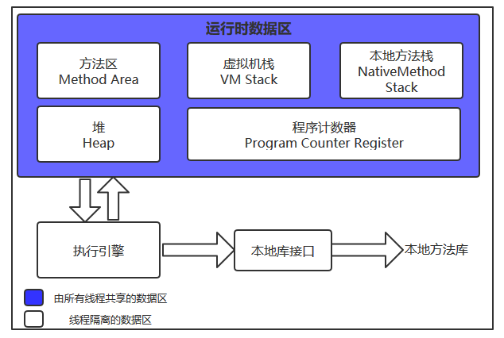
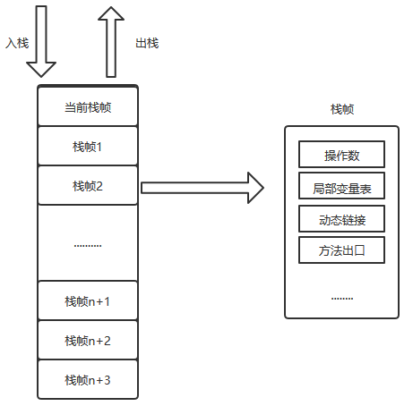
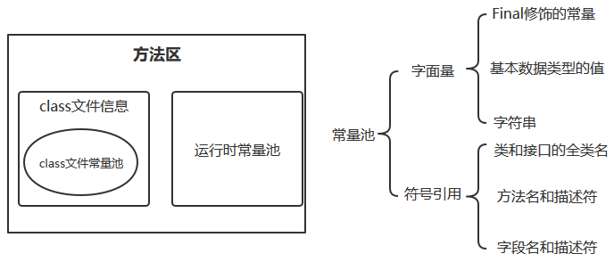

## 前言

​		关于JVM的部分，需要在对Java有了一定深入的认知的基础上再进行探索。这部分的知识非常重要，是提高自己能力所必备的技能。但是，JVM部分的内容有些晦涩，不像之前那么直观易懂。我准备采取蚂蚁搬家式的学习方法，每天攻克一个点。我相信，只要坚持下来，JVM这座大山终究会被我给慢慢搬光的。

## 何为JVM

​		JVM，全称叫做Java virtual machine，即Java虚拟机。我们要知道，Java之所以能获得如此广泛的认可度，除了它拥有一门结构严谨、面向对象的编程语言之外，还有许多不可忽视的优点：它摆脱了硬件平台的束缚，实现了“一次编译，处处运行”的理想；它提供了一个相对安全的内存管理和访问机制......而Java之所以能实现以上种种功能，核心就在于JVM。简单来讲，我们自己编写的Java程序编译完成后，试运行在JVM上的，而针对不同的操作系统，有不同版本的JVM，这样也就实现了Java代码对不同系统的兼容，即一次编译处处运行。

### JVM的内存区域划分

​		Java虚拟机在执行Java程序的过程中会把它所管理的内存划分成为若干个不同的数据区域，这些区域都有各自的用途以及创建和销毁时间。内存区域划分大致如下图所示：

​		程序计数器：一块较小的内存空间，可以看作是当前线程所执行字节码的行号指示器。在虚拟机的概念模型里，字节码解释器工作时就是通过改变这个计数器的值来选去下一条需要执行的字节码指令，分支、循环、跳转、异常处理、线程恢复等基础功能都需要依赖这个计数器来完成。在进行多线程任务的线程切换时，在任何一个时刻，一个处理器都只能执行一条线程的指令，为了切换后的线程能回到正确的位置，每个线程都需要一个独立的程序计数器。各条线程间的计数器互不影响，独立存储，这类内存区域被称之为“线程私有”的内存。如果线程正在执行的是一个Java方法，这个计数器记录的是正在执行的虚拟机字节码指令的地址；如果正在执行的是Native方法，这个计数器的值则为空（Undefined）。此内存区域是唯一一个不会发生内存溢出异常--OutOfMemoryError情况的区域。

​		Java虚拟机栈：线程私有，描述Java方法执行的内存模型，登记虚拟机执行的Java方法，每个方法执行时都会创建一个栈帧（Stack Frame）。栈帧是方法运行时的基础数据结构，用于存储局部变量表、操作数栈、动态链接、方法出口等信息。每一个方法从调用直至执行完成的过程，就对应着一个栈帧在虚拟机栈中入栈到出栈的过程。

​		其中，局部变量表存放着编译期可知的各种基本数据类型（boolean、byte、char、short、int、float、long、double）、对象引用和returnAddress类型（指向了一条字节码指令的地址）。其中64位长度的long和double类型的数据会占用2个局部变量的空间，其余数据类型只占1个。局部变量表所需的内存空间在编译期间完成分配，当进入一个方法时，这个方法需要在栈帧中分配多大的局部变量是完全确定的，在运行期间栈帧不会改变局部变量表的大小空间。

​		本地方法栈：登记虚拟机使用到的Native。

​		堆：是JVM所管理的最大的一块内存，由各个线程共享，在虚拟机启动时创建，用来存放对象实例，几乎所有的对象实例都是在这里分配内存。同时，堆也是垃圾收集器管理的主要区域，关于JVM的内存回收，后续再讲。

​		简单来讲，栈是运行单位，堆是存储单位。

​		方法区：各个线程共享，用于存储已被JVM加载的类信息、常量、静态变量、即时编译器编译后的代码等数据。方法区的一部分被称为运行时常量池，常量池中存储着编译器生成的各种字面量和符号引用。字面量就是Java中常量的意思，比如文本字符串，final修饰的常量等；方法引用则包括类和接口的全限定名，方法名和描述符，字段名和描述等。

​		

