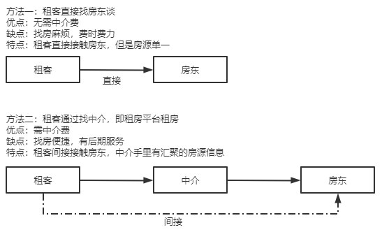

## 什么是AOP

### 回	顾IoC

​		我们都知道Spring框架的核心思想就是两个：IoC和AOP。Ioc简单来讲就是为了实现项目各层级设计的充分解耦，使软件更加地满足高内聚、低耦合的要求。IoC的功能可以简单的用下图表示


​			拿掉IoC容器后的系统如下图所示


​			简单来讲，我没可以把IoC容器理解为一个和黑箱，它起到了类似于一种“粘合剂”的作用，得到了对象的控制权，使得我们系统各个对象的依赖关系降到了最低限度。

### 关于OOP

​		在说AOP之前，我们必须得先聊一下OOP。

​		OOP，即面向对象编程。OOP是对于真实世界的映射，即将万事万物进行归类并建立模型，抽象出属性和方法，万物皆是对象。运用OOP的思想，我们在编程时就像搭积木一样，一点一点建立。简单来讲，OOP更接近于人类对于现实世界构建的真实想法。

### 引入AOP

​		我们要思考这样一个问题，既然OOP就能解决问题，为什么还要创造出AOP呢？

​		对于面向对象编程，我们的系统功能设计总体上来看是纵向的。以web开发为例。控制器调用服务，服务调用Dao。我们假设这样一种需求场景：

​		你有一段业务代码，有一天，老板让你统计一下每天使用功能A的人数。于是，你在A的代码后面加上了一段代码，实现了统计每天的使用人数；

​		又过了一周，老板说为了提高系统运行效率，我们需要看一下功能A每次的执行时间。于是，你在A的代码前后加上了新的代码，实现记录功能A执行时间的功能；

​		又过了一周，老板说咱们这个系统万一出错了，得记录下日志。于是，你又在功能A的代码后面加上了一段实现日志功能的代码；

​		又过了一周.......

​		时间久了，你会发现功能A的内部代码不仅变得臃肿无比，而且大量充斥着和功能A的业务无关的代码。更为恐怖的是，新加的功能也许不仅仅是功能A需要，或许功能B、功能C、功能D....都需要，如果不想出一个优雅的解决方案，我么就需要对功能B、功能C、功能D....一个个进行方法注入，工作量巨大无比且不说，代码也极为冗余。就算你把这些代码写的再规范，再怎么抽时间去优化，这些代码也已经破坏了OOP特性之一的封装性，造成了代码污染。

​		所以，AOP就诞生了。AOP就是为了解决OOP无法满足的需求，即提供一个横切的方法，不破原始代码的封装性，对已有的代码进行扩展，从而实现更为丰富的功能。而对于上面的例子而言，我们可以运用AOP的思想，把和主干业务无关的功能代码给抽取出来，然后在这些功能运行时将其动态的横向插入进去，减少耦合度和代码冗余。

​		那么，AOP是如何实现这种“动态的横向插入”的呢？这里就要说到另一种设计模式：代理模式。

### 代理模式

​		举一个现实中的例子，假设我们此刻要去租一间房子住，有两种方法



​		这个实例其实可以大概说明代理模式的含义。在这里，中介其实充当的就是租客的代理，租客之和中介接触，不直接接触房东。也就是说，中介其实帮租客把找房过程中的找地段、谈租金等，和房东签房屋租赁合同的事情给干了，租客只需要完成租房这个抽象的主干业务即可。代理模式又分为静态代理和动态代理，我们先来看一下静态代理的代码实现。

### 静态代理

```java
/*	静态代理
    第一步：定义抽象的主干业务，即租房
 */
public interface RentHouse {
    void rentHouse();
}
/*
    第二步：定义租客，实现租房接口，表明租客有租房的需求
 */
public class Tenant implements RentHouse{
    public void rentHouse() {
        System.out.println("租客：我想租房！");
    }
}
/*
    第三步：定义中介，中介是要帮租户实现租房子的
           需求，所以也要实现租房接口
 */
public class RentHouseProxy implements RentHouse{
    private RentHouse rentHouse;
    public RentHouseProxy(RentHouse rentHouse){
        this.rentHouse=rentHouse;
    }
    public void rentHouse() {
        System.out.println("中介：搜集房源......");
        System.out.println("中介：对比市场价格......");
        System.out.println("中介：确定租金......");
        System.out.println("中介：前房屋租赁合同......");
        System.out.println("中介：装修装修，摆点物件......");
        rentHouse.rentHouse();
        System.out.println("中介：租房完毕......");
    }
}
/*
    测试
    结果：中介：搜集房源......
         中介：对比市场价格......
         中介：确定租金......
         中介：前房屋租赁合同......
         中介：装修装修，摆点物件......
         租客：我想租房！
         中介：租房完毕......
 */
public class ProxyDemo {
    public static void main(String[] args) {
        RentHouse rentHouse=new Tenant();
        RentHouseProxy proxy=new RentHouseProxy(rentHouse);
        proxy.rentHouse();
    }
}

```

​		通过以上案例代码我们可以看到，代理模式在不修改被代理对象的基础下，进行了一些功能的附加与增强。至于为什么被称为静态代理，那是因为我们的代理类是事先预定好的，即已经写死了。同时，我们也应该注意到它的缺陷之处：每一个抽象的事务都是一个接口，我们的代理类需要实现这个接口，即我们得为每一个服务都创建一个代理类，工作量太大，不易管理。而且，接口一旦发生改变，代理类也得同步进行相应的修改

### 动态代理

​		动态代理我们不需要再手动创建代理类，只需要编写一个动态代理处理器即可，真正的代理对象由JVM在运行时为我们动态的创建，这就是它之所以被称为动态代理的由来。我们看一下案例代码

```java
/*
    动态代理
 	前两步与静态代理相同
 */
public class DynamicRentHouseProxy implements InvocationHandler {
    private Object rentHouse;

    public DynamicRentHouseProxy(Object rentHouse) {
        this.rentHouse = rentHouse;
    }

    @Override
    public Object invoke(Object proxy, Method method, Object[] args) throws Throwable {
        System.out.println("中介：搜集房源......");
        System.out.println("中介：对比市场价格......");
        System.out.println("中介：确定租金......");
        System.out.println("中介：前房屋租赁合同......");
        System.out.println("中介：装修装修，摆点物件......");
        Object result=method.invoke(rentHouse,args);
        System.out.println("中介：租房完毕......");
        return result;
    }
}
public class ProxyDemo {
    public static void main(String[] args) {
        /*RentHouse rentHouse=new Tenant();
        RentHouseProxy proxy=new RentHouseProxy(rentHouse);
        proxy.rentHouse();*/
        RentHouse tenant=new Tenant();
        InvocationHandler handler=new DynamicRentHouseProxy(tenant);
        //newProxyInstance运用反射为我们生成一个代理类对象
        RentHouse rentHouse=(RentHouse) 	       Proxy.newProxyInstance(Tenant.class.getClassLoader(),
                Tenant.class.getInterfaces(),handler);
        rentHouse.rentHouse();
    }
}
```

​		看下Proxy类newProxyInstance()的源码

```java
//ClassLoader:根据类的字节码直接生成这个类的Class对象
//interfaces：由委托实现的接口的Class对象数组，主要是包含了最重要的代理类需要
//			  实现的接口方法的信息
//h：一个实现了InvocationHandler接口的对象
//简单来讲第一个参数ClassLoader和第二参数接口的Class对象是用来动态生成委托类的
//包括类名，方法名，继承关系在内的一个空壳。只有接口定义的方法名，没有实际操作。实
//际的操作是由第三个参数InvocationHandler的invoke()方法来执行
public static Object newProxyInstance(ClassLoader loader,
                                      Class<?>[] interfaces,
                                      InvocationHandler h) {
    Objects.requireNonNull(h);

    final Class<?> caller = System.getSecurityManager() == null
                                ? null
                                : Reflection.getCallerClass();

    /*
     * Look up or generate the designated proxy class and its constructor.
     */
    Constructor<?> cons = getProxyConstructor(caller, loader, interfaces);

    return newProxyInstance(caller, cons, h);
}
```

​		以上就是动态代理的案例代码。显而易见，我们的代理类并不知道事务的具体名称，也就是说，就算接口中的方法变了，我们的代理类也丝毫不受影响，代理逻辑与业务逻辑是相互独立的，没有耦合。

​		代理模式还有一种方式，叫做CGLib，这里暂且不说。

## 总结

​		AOP通过代理模式，将自己要处理的事务横切入系统中，实现了面向切面的编程。同时，实现AOP的核心技术是反射。而关于反射，只有将JVM摸了一遍后才能总结的较为完善。