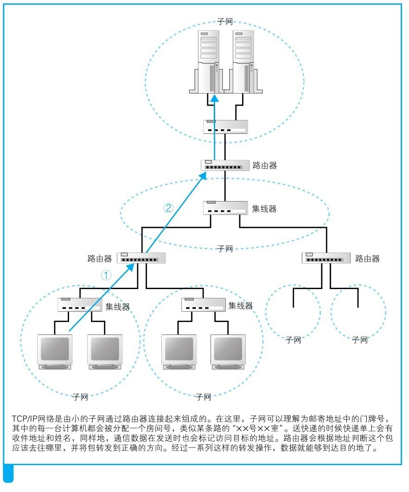

三、IP地址

生成HTTP消息之后，接下来就需要委托操作系统把消息 发送给服务端。但是，在进行这一步之前，我们仍有一个非常重要的步骤需要做：找到服务器在哪里。“找到服务器在哪里”看起来似乎是一句废话，但是它的意义及其背后所用到的底层原理却是非同小可的，关乎着我们身边的这座名为“Internet”的大厦的根基。

提到Internet，我们不妨稍加深入，说一下它到底是什么。从广义上来讲，互联网是基于TCP/IP的思路来设计的：无数个小网络使用路由器连接起来，组成一个大网络；无数个大网络同样使用路由器连接起来，组成一个更大的网络.......以此往后，最终便组成了如今这个“人人互联”的广义上的互联网，就像下图这样。至于TCP/IP协议背后究竟有着什么原理，以后再展开来讲。

就像我们每个人都有唯一的身份证一样，在网络中鉴别我们身份的方法就是IP地址。

