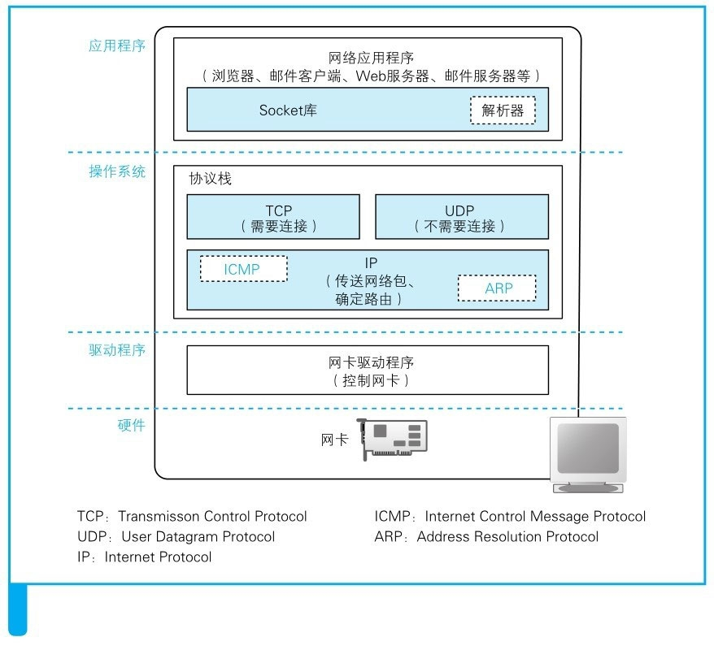
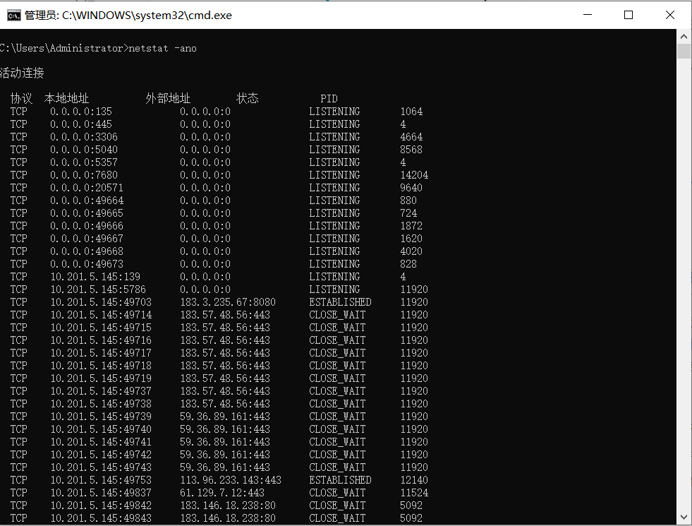

### 五、关于套接字

从请求到DNS，我们已经搞明白了信息是如何发送以及正确地寻找并传输给指定主机的。接下来，我们看一下在应用层面，操作系统中的网络控制软件（协议栈）和网络硬件（网卡）是如何将浏览器的消息发送给服务器的。先看一下协议栈的内部结构

可以看出，协议栈的内部是严格遵循着分层设计的思想的：最上面的是网络应用程序，也就是浏览器、电子邮件服务端、Web服务器等程序，它们会将收发数据的工作委派给下层的部分来完成；应用程序下面的Socket库，其中的解析器用来向DNS服务器发出查询；再往下的操作系统内部，包括各种协议栈。上面一半是TCP和UDP协议，像浏览器、邮件等一般的应用程序都是使用TCP来收发数据的，而像DNS查询等收发较短的控制数据的时候则使用UDP。下面的一半是用IP协议控制网络包收发操作的部分，在互联网上传输数据时，数据会被切分成一个个的网络包，而将网络包发送给通信对象的操作就是由IP来负责的；IP下面的网卡驱动程序负责控制网卡硬件，而最下面的网卡则负责完成实际的收发工作。

我们已经深入了解了协议栈的内部构造，接下来看一下套接字究竟是一个什么东西。

在协议栈内部有一块用于存放控制信息的内存空间，这里记录了用于控制通信操作的控制信息，例如通信对象的IP地址，端口号、通信操作的进行状态等。本来套接字就只是一个概念而已，并不存在着实体，如果一定要赋予它一个实体，我们可以说这些控制信息就是套接字的实体，或者说存放控制信息的内存空间就是套接字的实体。

简单来讲，套接字中记录了用于控制通信操作的各种控制信息，协议栈则需要根据这些信息判断下一步的活动，这就是套接字的作用。

打开电脑的cmd窗口，输入netstat -ano指令，便可看到电脑中所有的套接字连接情况

PS：netstat是用于显示套接字内容的命令

​		a  不仅显示正在通信的套接字，还显示尚未开始通信等其他状态的所有套接字

​		n  显示IP地址和端口号

​		0  显示使用该套接字的程序的pid