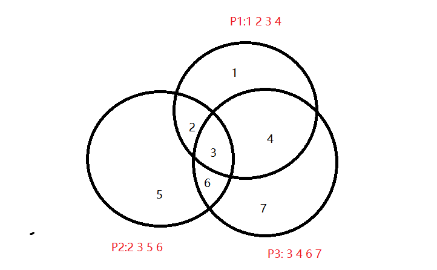

### 引言

互联网时代，信息传输的基础媒介是比特流，即承载着各种有效信息的01串。换句话说，我们在手机上或者电脑上看到的各类媒体信息，例如文字信息、图片信息亦或是视频信息，其根源上都是一些由二进制的0和1组成的比特流。只要信息存在着流动，那么在传输过程中必然有可能出现差错。以二进制下传输数字3为例，3表示为八位二进制为0000 0011，传输过程中，可能会出现某种不可预测的原因，使得序列某一位或者某几位产生错误。那么，我们应该采取何种的方法来检测出错误的信息呢？

### 一、奇偶校验

奇偶校验是一种较为简单的校验方法，其检测的是被传输的一组二进制代码数位中的“1”的个数，根据1的个数是奇数或是偶数，又可以分为奇校验和偶校验。我们以奇校验为例，说一下其校验的详细过程。

奇校验即**确保传输的每一组二进制代码数位中1的个数为奇数**。以一个字节为例，一个字节包含八个无符号比特位。我们仍以数字3为例，看一下其引入奇校验的过程。

十进制的3在二进制下存储在一个字节内，表示为 0000 0011 ，当引入奇校验时，我们需要把最高位的0设置为校验位，即第一个0不存储数据信息，仅作为校验位存在。此时，表示数据信息的比特位数变成了7位，即 000 0011。可以看到，此时整个数据中位数值为1的数据位的个数是2，即偶数，所以我们需要在最高位补1，确保整组二进制代码中数位值为1的个数为奇数，即1000 0011。

同理，当传输2时，2的二进制表示为000 0010，此时1的个数已经为奇数，则需要在最高位补0，即0000 0010。

假设传输3时某一位出现了问题，1000 0011变成了1100 0011，接收方收到数据1100 0011后，首先会校验整组数据中1的个数，发现其中1的个数为偶数，所以立刻便知道了这组数据是不对的。

奇校验的做法很简单也很高效，但是却存在着两个不可调和的弊端：

1.只能校验奇数个位数错误，不能发现偶数个位数错误

假设传输3是有两位数都发生了错误，即1000 0011变为了 1110 0011，当接收方接收到这组数据后，首先校验整组数据中1的个数，发现1的个数为奇数，便会认为这组数据并没有问题。所以，当有偶数个错误时，奇校验并不能发现其中的问题。

2.只能发现问题，却不能解决问题

很显然，通过奇校验的方式虽然能发现数据是否在传输过程中发生了错误，但是却并不能定位到究竟是哪一位出了错误。

偶校验的原理和奇校验相同，只是偶校验是**确保传输的每一组二进制代码数位中1的个数为偶数**。所以，奇校验存在的问题偶校验也依然存在。

那么，是否存在着一种校验方法，可以准确的定位到究竟是哪一位出现了错误呢？答案当然是肯定的：汉明码。

### 二、汉明码

在说汉明码之前，我想简要的讲一下汉明码的由来-----因为当昨天整明白整个汉明码的逻辑推导过程后，我是真的被汉明的智慧给折服了。此刻的汉明在我心中，真他娘的是个天才！此刻还是得小声bb两句：人与人的差距是真的大，大佬们的智慧着实让我无法企及。

事情还要从上个世纪四十年代开始讲起，那时候的汉明老爷子还在大名鼎鼎的贝尔实验室上班（此刻又想小声bb两句：贝尔实验室真是个神一样的地方，可以说是直接推动了人类科技的发展）。那个时候世界上第一台真正意义上的电脑“埃尼阿克”还没有被发明，汉明操作着一台用于计算的类似电脑的机器，这台机器的输入端是依靠打孔纸带。靠纯物理的方法来录入数据，可想而知必然会发生错误。平时在工作日里还好，因为有专门的操作员值守，机器发现错了会立刻报警，所以操作者可以记录并解决卡带纸上出现的错误。但是，到了休息日或者节假日就彻底完犊子了：由于没人值守，机器发现错误报警后没人处理，所以仍然会进行下一个工作。汉明同志在周末工作时，由于机器的操作员都放假了，所以不断地会遇到发生错误而导致从头开始执行程序，这使得他非常烦。于是，他便开始思考这样一个问题：既然机器可以发现问题，那么为什么不能想办法让机器变得更加智能，即不仅能准确定位到错误发生的位置，还能自动纠正错误呢？基于以上的猜想，汉明在一次次的改善后，终于探究出了如今具有准确定位错误和自动纠错的汉明码校验法。

在介绍汉明码之前，我们不妨看一下如下的一个有趣案例：把1-7七个数字通过某种方式传输（传输的过程中有可能会出现错误），为了及时发现并准确定位至出错的数字（**此处假设只会发生一位数字的错误**），我们可以按照如下图所示把这七个数字分为P1、P2、P3三组：

P1组：1	2	3	4

P2组：2	3	5	6

P3组：3	4	6	7

分组完毕后，我们给每一组都加一个校验位（接收方可以通过校验位得知本组数据在传输过程中是否出错，但是无法准确定位至错误位置），然后把这三组作为一个整体发送出去。

接收方收到数据后，经过查看各小组的校验位，发现第P1错了，P2和P2都没错。根据分组情况，我们可以轻易地判断出一定是数字1出错了：因为属于P1但又不属于P2和P3的数字只有1。

同理，若是接收方发现P1和P2都错了，但是P3没问题，我们也可以根据分组轻易的定位到是数字2出现了问题；若是接收方发现P1、P2和P3都错了，显然一定是数字3出现了问题。

可以发现，经过特定的分组后，1-7这七个数字在传输过程中任意一个数字发生了错误，就都能被我们给检测到。而汉明码的内核，其实跟这个例子是一样的。

思维延伸开来，我们把上述例子中用来检测数字错误的方法发散至计算机领域，即只有0和1存在的世界。

进入计算机的世界后，我们发现事情似乎变得更容易处理了：在刚才的例子中我们虽然能定位至出错的数字所在的位置，但是却并不能将出错的数字恢复至正确的状态。换句话说就是，数字3在传输过程中可能变成了8，我们只能知道传过来的这个8是错误的，但是并不能知道正确的是3，即不能纠错。然而，计算机的世界只有二进制的0 1字符，接收方发现传过来的0出错了，则正确的必然是1，反之亦然。

接下来，我们还需要引入一个叫做校验码的东西。我们只需要记住，在传输一串数据时，校验码位于这串数据2的i位置上。也就是说，传输一串8bit的数据，校验码要占据其中四个比特位，即1,2,4,8；传输一串10bit的数据，校验码也是占据其中四个比特位，如下图所示：

上图中橙色填充的比特位存储校验码，而白色的格子则用来存储数据。