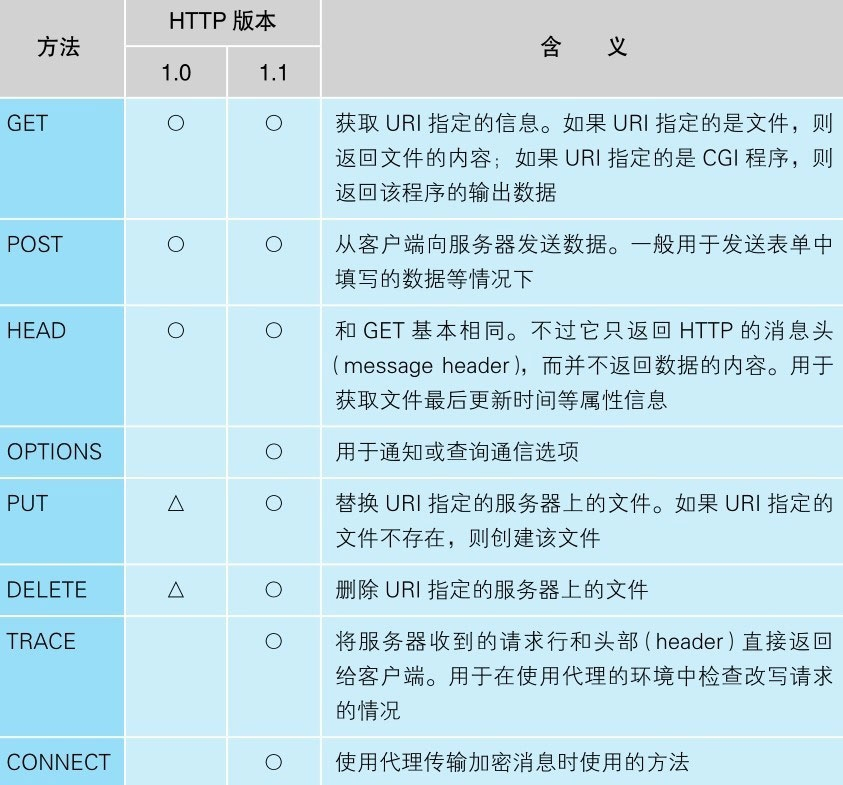
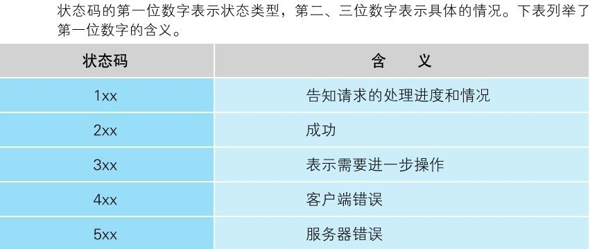

### 前言

当我们周末无聊窝在家里，打开自己的笔记本电脑，点开浏览器熟练的用双手敲出那串神秘的‘’http://www.xxx.com“字符，然后换个姿势准备好好学习时可否深入的想过，为什么当自己敲下回车键的那一刻，紧张而又刺激的学习资料会立马出现在自己的眼前呢？要解决这个问题，我们要先从网址开始聊起。准确的说，应该叫做URL（Uniform Resource Locator），即统一资源定位符。当然，叫URL可能还是有点抽象，我么不妨把它称之为http开头的一坨东西。

### 一、发送HTTP请求

我们来拆解一下常见的百度的官网http://www.baidu.com，大致可以分为两部分：http://代表此次请求采用的是http协议；www.baidu.com则代表所要请求的web服务器的域名。所以，要想成功访问到百度的官网，浏览器需要做的第一步，就是解析URL。当然，在解析URL之前，我们必须得先知道HTTP协议到底是什么鬼。

HTTP协议定义了客户端和服务端之间交互的消息内容和步骤，其基本思路非常简单：它将客户端发起的请求抽象的分解为了两部分----“对什么”和“进行怎样的操作”。“对什么”的意思是我要对什么东西进行后续的操作，而“进行怎样的操作”则定义了操作的具体内容。其中相当于“对什么”的部分称之为URI（Uniform Resource Identifier），即统一资源标识符。简单来讲，URI的内容一般是一个存放网页数据的文件或者是一个可运行的服务端程序的文件名。换句话说，URI就是我们可以访问的目标。相当于“进行怎样的操作”的部分称之为方法，其表示要让Web服务器完成怎样的操作，常见的无非就是增删改查。下图是HTTP1.1的主要方法



收到客户端浏览器发的请求消息后，服务器会对其中的内容进行解析，通过URI和方法来判断需要对什么进行怎样的操作。举例来讲，当我们访问百度官网时，发送http://www.baidu.com的请求消息后，服务器会拿到本次请求的URI（www.baidu.com）和请求方法GET（GET请求默认可省略）。然后通过查找找到URI在服务器上所对应的资源（我们不妨简单的认为是一个网页），返回给客户端浏览器展示。当然，发送请求后还发生了特别多有趣的事情，我们先不摊开讲。

### 二、HTTP请求的构成

接下来，我们详细的来说一下上文中这个发出去的HTTP请求。

对URL进行解析后，浏览器确定了web服务器和文件名，然后就要生成HTTP请求发往服务器。实际上，这一个简单的生成步骤也是复杂无比的：HTTP消息在格式上有严格的规定。以下是访问百度官网时其中一个请求请求头的详细构成

```java
/**
 * GET / HTTP/1.1  第一行成为请求行，通过这一行可以大致了解请求的具体内容
 * 这一部分成为消息头，每行包含一个字段，用于表示请求的附加信息，一直延伸到空行为止
 * Host: www.baidu.com  请求的主机
 * 客户端信息，即客户访问用的浏览器名称、版本、内核和当前操作系统的版本
 * User-Agent: Mozilla/5.0 (Windows NT 10.0; Win64; x64; rv:80.0) Gecko/20100101 Firefox/80.0
 * 客户端支持的数据类型，一般以MIME来表示
 * Accept: text/html,application/xhtml+xml,application/xml;q=0.9,image/webp;q=0.8
 *      客户端支持的语言
        Accept-Language:zh-CN,zh;q=0.8,en-US;q=0.7,en;q=0.5,zh-TW;q=0.3,zh-HK;q=0.2
        //身份认证数据
        Authorization:BearereyJhbGciOiJSUzI1NiJ9.eyJzdWIiOiJlbXBsb3llZTphZG1pbiIsImV4cCI6MTYwMDA1NDQzMCwiaWF
                        0IjoxNTk5NDQ5NjMwfQ.HGt0Vku-r5IxU0bHVjGZSi8gI4EanzMT2ob6Cn13z8JgItfS0vFPztmBy
        客户端支持的编码格式，一般表示数据的压缩格式
        *Accept-Encoding:gzip,deflate,br
 *      发送请求后TCP继续保持连接
        *Connection:keep-alive
 *      请求附带的本地cookie
        *Cookie:BAIDUID=DD92F465F3F2CBD422B129209B0EFEA0:FG=1;BIDUPSID=DD92F465F3F2
        
 */
```

发送了请求必然会收到响应，我们称之为响应头。响应头的基本结构和请求头大致是一样的，最主要的差别在第一行上。响应头的第一行为状态码和响应短语，用来简略地表示本次请求是成功还是失败。状态码是一个数字，主要是用来告知程序执行的结果。下图是HTTP状态码的简要说明



接下来我们详细的看一下响应头的基本构成

```java
/**
 * HTTP/1.1 200 状态行，200表示请求成功
 * Server: nginx/1.19.1 服务器的名称
 * Date: Mon, 07 Sep 2020 10:36:41 GMT 当前时间
 * Content-Type: application/json;charset=UTF-8 返回的数据类型及编码
 * Transfer-Encoding: chunked 消息主体的编码格式
 * Connection: keep-alive 发送请求后TCP继续保持连接
 * Cache-Control: no-cache, no-store, max-age=0, must-revalidate 缓存控制
 * Pragma: no-cache 表示数据是否允许缓存进行通信
 * Expires: 0 消息体的有效期
 *
 * 以下为返回的消息体
 */
```

收到返回响应的消息后，浏览器会将数据提取出来并进行展示，这也就完成了一次HTTP请求从封装、发送再到返回的基本过程。